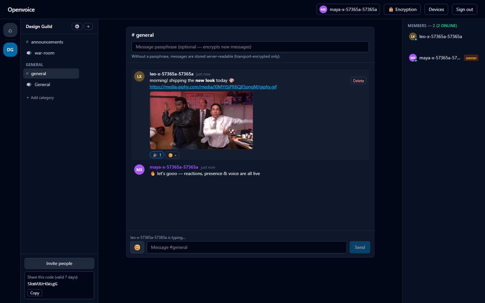
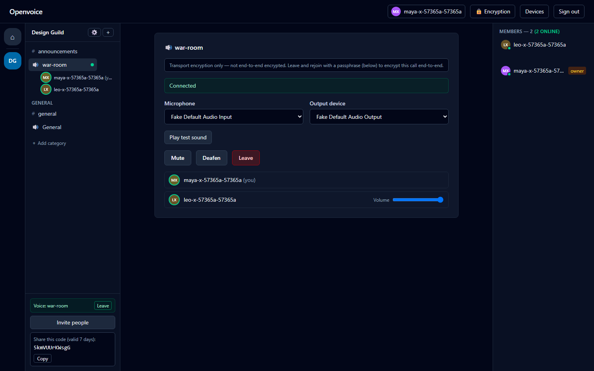

# Openvoice

**An open-source, self-hostable voice & community platform.** Communities with
text and voice channels, low-latency group voice, opt-in end-to-end encryption,
and a rich real-time client — with no ads, no paywalls, no feature gates, and no
mandatory hosted services.



> **Status: alpha.** Everything below works and is covered by an automated test
> suite, but the project has **not** had an independent security audit. Don't
> use it for real sensitive communication yet. See
> [Security status](#security-status--read-this-first).

---

## Features

**Communities & channels**
- Create communities; organize categories, text channels, and voice channels
- Create / rename / delete channels from the sidebar (permission-gated)
- Invite links with expiry and use limits
- Roles, per-channel permission overrides, and a deny-by-default permission
  engine (owner / administrator / moderator / member)
- Kick, ban / unban, and an administrative audit log

**Voice**
- Reliable low-latency group voice over a self-hosted [LiveKit](https://livekit.io) SFU (WebRTC + Opus)
- Device selection, mic test with a live level meter, "hear myself" monitoring, output test tone
- Mute, deafen (implies mute), per-participant volume, speaking indicators, connection-quality states
- TURN relay for restrictive networks; honest reconnect/disconnect states
- **Opt-in end-to-end encryption** with a shared call passphrase — the server
  cannot access the audio



**Chat**
- Live messages with edit, delete (tombstones), and cursor pagination
- **Opt-in end-to-end encrypted messages** (client-side AES-GCM; the server
  stores only ciphertext)
- Emoji reactions, an emoji picker, and safe rich text (bold / italic / code / links)
- Inline **GIF & image embeds** (paste a Giphy/Tenor/image link — rendered
  client-side, no server fetch)
- Message grouping, relative timestamps, and XSS-safe rendering

**Presence & identity**
- Online presence dots + counts, and live "is typing…" indicators
- Profiles: display name, accent colour, pronouns, bio, and clickable profile cards
- Per-device identity keys (private key stays in the browser; view / revoke devices)
- Cookie sessions with per-device session management and revocation

**Operations**
- One-command Docker Compose dev stack (PostgreSQL, Redis, LiveKit, Caddy)
- Structured logging, health/readiness checks, database migrations
- Works across devices on your LAN (phone + desktop) over HTTPS with a single
  certificate

## Security status — read this first

Openvoice is honest about what is and isn't protected:

- **Voice** is end-to-end encrypted when everyone in a call enters the same
  passphrase (LiveKit's audited frame-encryption keyed by a client-side
  passphrase). The SFU, API, database, and operator cannot access that audio —
  verified by a test in which a fully-authorized client with the *wrong*
  passphrase gets only silence. Without a passphrase, voice is transport-encrypted
  only (DTLS-SRTP) and the operator can access it. The UI always shows which.
- **Text messages** are end-to-end encrypted when you set a channel passphrase
  (client-side AES-GCM via Web Crypto; the server stores an opaque ciphertext
  envelope). Without a passphrase they are transport-encrypted only.
- **Metadata is always visible** to the operator: who is in which community and
  channel, timing, and traffic volume.
- **No custom cryptography** — WebRTC, Opus, LiveKit's E2EE, and Web Crypto only.
- Passphrases are shared out-of-band and there is **no automatic key rotation
  yet**; automatic group keying (MLS) is the planned next step.

Full threat model: [`docs/security/threat-model.md`](docs/security/threat-model.md).
Report vulnerabilities per [`SECURITY.md`](SECURITY.md).

## Quick start (local development)

**Prerequisites:** Docker with Compose v2, Node.js 22+, and Git. (Local Python
is not required — the API runs and is tested in a container.)

```sh
git clone https://github.com/aloy41/openvoice.git
cd openvoice
cp .env.example .env      # then set the CHANGE_ME secrets (instructions inside)
docker compose -f docker-compose.dev.yml up --build
```

Open **http://localhost:8080**, create an account, and start a community. Open a
second browser (or your phone on the same network — see
[`docs/operations/local-development.md`](docs/operations/local-development.md))
to try voice, chat, reactions, and presence between two users.

Verify the stack:

```sh
curl http://localhost:8080/api/healthz    # {"status":"ok"}
curl http://localhost:8080/api/readyz     # checks PostgreSQL + Redis
```

## Running the tests

```sh
# API (unit + integration against real PostgreSQL/Redis, in a container)
docker compose -f docker-compose.dev.yml run --rm api pytest

# Web unit/component tests, typecheck, lint, build
npm install
npm run test -w apps/web && npm run typecheck -w apps/web && npm run build -w apps/web

# End-to-end (full stack up): voice, chat, reactions, presence, E2EE, a11y, …
npm run test:e2e
```

## Tech stack

| Layer | Technology |
| --- | --- |
| Web client | React 19, TypeScript, Vite, Tailwind CSS, TanStack Query, livekit-client |
| API | Python 3.12, FastAPI, Pydantic v2, SQLAlchemy 2 (async), Alembic |
| Data | PostgreSQL 16 (source of truth), Redis 7 (presence / ephemeral / fanout) |
| Media | Self-hosted LiveKit SFU (WebRTC + Opus), TURN |
| Realtime | WebSocket event stream with a durable per-community event log + replay |
| Encryption | LiveKit E2EE (voice), Web Crypto AES-GCM/PBKDF2 (messages), ECDSA device keys |
| Deployment | Docker Compose, Caddy reverse proxy |

The OpenAPI schema is authoritative; the TypeScript client is generated from it
and CI fails on drift. Architecture and decisions are documented in
[`docs/architecture/`](docs/architecture/) and [`docs/adr/`](docs/adr/).

## Project layout

```
apps/api/           FastAPI control plane
apps/web/           React + TypeScript client
packages/api-client/  TypeScript client generated from the OpenAPI contract
infra/              LiveKit + Caddy configuration
docs/               Architecture, ADRs, security, operations
tests/e2e/          Playwright end-to-end tests
```

## Contributing

See [`CONTRIBUTING.md`](CONTRIBUTING.md), [`AGENTS.md`](AGENTS.md), and
[`CODE_OF_CONDUCT.md`](CODE_OF_CONDUCT.md). Core rules: security claims must be
technically accurate, no custom cryptography, schema changes go through
migrations, and every behaviour change ships with tests.

## License

[Apache License 2.0](LICENSE). See [`NOTICE`](NOTICE) for attribution.
